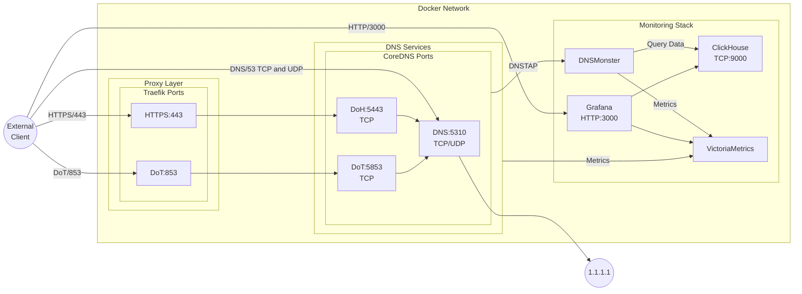

# fdns
Forward DNS. My Own version of pi-hole. This is ideal for self-hosting your own resolver and get complete monitoring on your DNS traffic.

This is a standalone project and has no affiliation with Pi-hole.

Components:

- [CoreDNS](https://coredns.io/)
- [dnsmonster](https://github.com/mosajjal/dnsmonster)
- [ClickHouse](https://clickhouse.com/)
- [Grafana](https://grafana.com/)
- [VictoriaMetrics](https://victoriametrics.com/)
- [StevenBlack's hosts file](https://github.com/StevenBlack/hosts)
- [Traefik](https://traefik.io/)



## Prerequisites

To install fdns, you need a Linux host with the following requirements met:

### Required Packages

- curl
- jq
- openssl
- docker
- docker-compose (version 2.30.0+)
- sed

## Required network ports

Also, you need to make sure the following ports are available on your host:

- 53 (TCP and UDP)
- 80 (for ACME HTTP verification)
- 443 (for DNS Over HTTPS)
- 853 (for DNS Over TLS)
- 3000 (for Grafana)

<!-- ## Required IP and DNS Settings -->
<!---->
<!-- Since `fdns` is meant to be run with TLS, and it uses ACME to obtain the certificate (with http verification), you need to make sure you have a Domain (or a subdomain) that is pointing to this server.  -->
<!---->
<!-- meaning, if your domain is `doh.example.com`, there needs to be an A record pointing to this server's public IP, or similiarly accessible through CNAME etc.  -->
<!---->
<!---->
<!-- Let me revise this section to be clearer and more comprehensive. -->

## DNS Configuration Requirements

Before deploying `fdns`, ensure your DNS records are properly configured since the service relies on TLS certificates obtained through ACME HTTP verification.

### Required Setup
1. A domain or subdomain dedicated to your `fdns` instance (e.g., `doh.example.com`)
2. DNS records pointing to your server's public IP address through either:
   - An A record: `doh.example.com  IN  A  203.0.113.1`
   - Or a CNAME record if pointing from another subdomain

### Example Configuration
```dns
; Direct A record
doh.example.com.    IN    A    203.0.113.1

; Or via CNAME
doh.example.com.    IN    CNAME    server.example.com.
```

This DNS configuration is essential for:
- Automatic TLS certificate provisioning via ACME
- Enabling secure DNS-over-HTTPS (DoH) and DNS-over-TLS (DoT) functionality
- Ensuring proper service accessibility

Make sure these DNS records are active and properly propagated before deplooying the service.


## Installation

After carefully checking your requirements, run the following commands to install `fdns`:

```
./autobuild.sh
```

above command will:

- help set up a TTL for your DNS storage so your DNS records don't take up a lot of space
- make sure your DNS records are properly configured
- asks for your domain name and ACME email address, and replaces those within configuration files
- spins up the containers, SQL tables, and waits for them to be ready
- installs the ClickHouse plugin for Grafana (reqires internet connection)
- sets up the connections for ClickHouse and VictoriaMetrics
- imports and configures Dashboards for Grafana

within a few minutes, you should be able to access your `fdns` through all the protocols mentioned above (in the diagram)

IMPORTANT NOTE: Grafana's credentials are `admin/admin` by default. it's CRITICAL that you change these credentials as soon as possible.

## Usage

Once you have installed `fdns`, you can set up your clients to use DoH/DoT as below:

### Android (9 or higher)

1. Go to Settings → Network & internet → Advanced → Private DNS.
2. Select the Private DNS provider hostname option.
3. Enter your public FQDN and hit Save.

alternatively, use the ipv4/ipv6 directly inside your wifi settings as a custom DNS resolver

### iOS (14 or higher)

use https://dns.notjakob.com/tool.html to create a new profile and install on your device

alternatively, use the ipv4/ipv6 directly inside your wifi settings as a custom DNS resolver


### Windows (11)

    Open the Settings app.
    Go to Network & internet.
    Click on Wi-Fi (or Ethernet).
    Click on Hardware properties, or ignore this step if you clicked on Ethernet.
    Click the Edit button next to DNS server assignment.
    Select Manual.
    Enable IPv4.
    Enter your server's public IP as Preferred DNS, then select On (manual template) and enter https://your-fqdn
    Click Save.
    
    
alternatively, use the ipv4/ipv6 directly inside your wifi settings as a custom DNS resolver


### Linux 

systemd-resolved
Use the following in /etc/systemd/resolved.conf:
[Resolve]
DNS=your-public-ip#your-fqdn
DNSOverTLS=yes

alternatively, use the ipv4/ipv6 directly inside your wifi settings as a custom DNS resolver


### Mac

easiest way to configure Mac DNS is through Network setting's DNS. 

1. Open System Preferences, then click on Network.
2. Select the network you are connected to, then click on the Advanced button.
3. Go to the DNS section.
4. In the DNS Servers list, remove all addresses (if any) then add your public ip
5. Click OK, then click Apply.


## Screenshots


